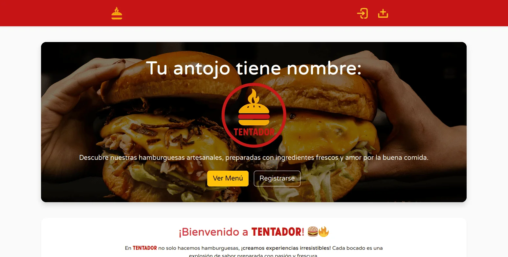
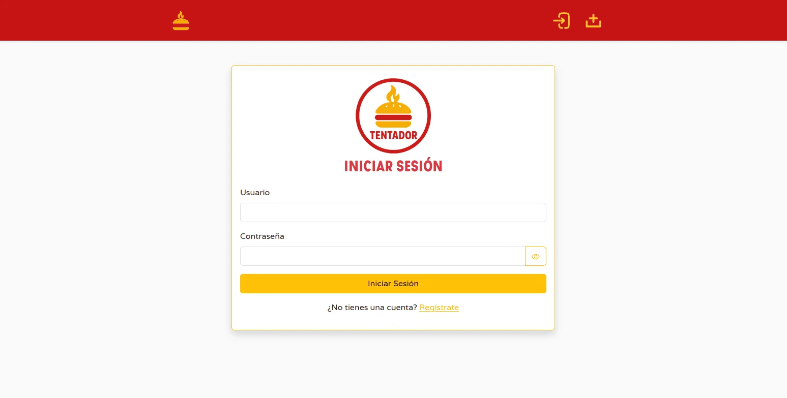
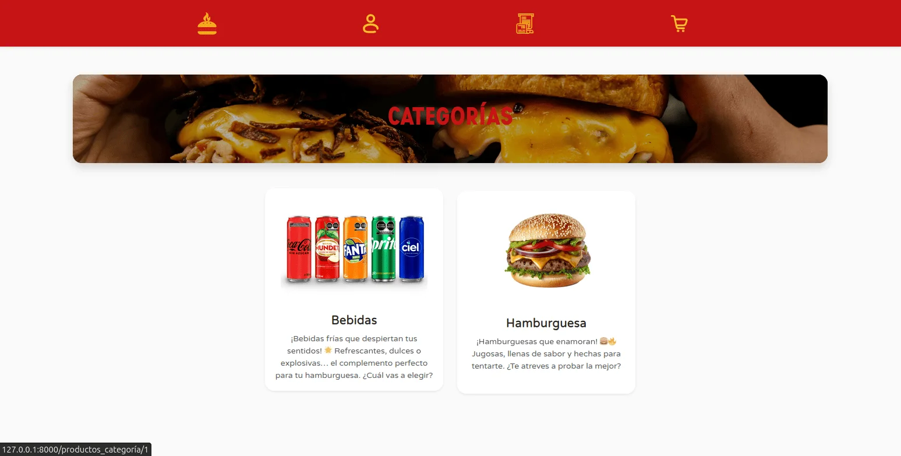
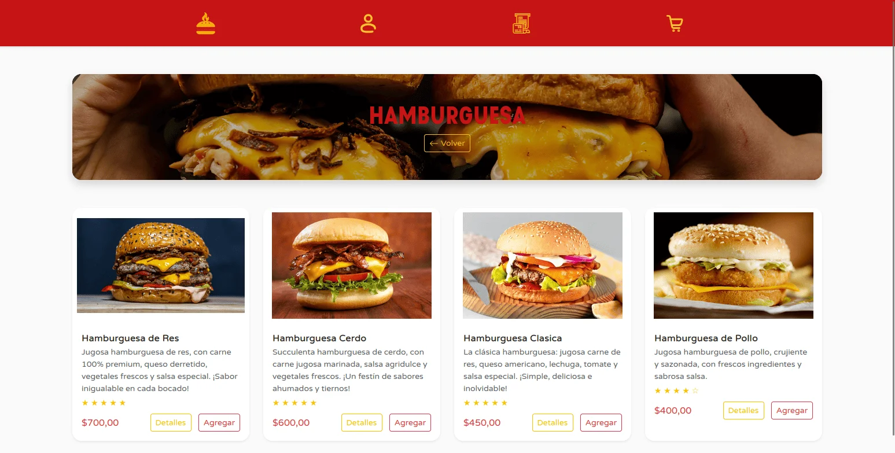
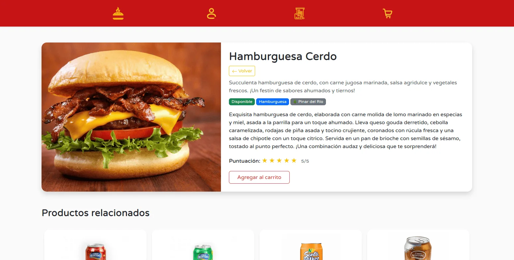
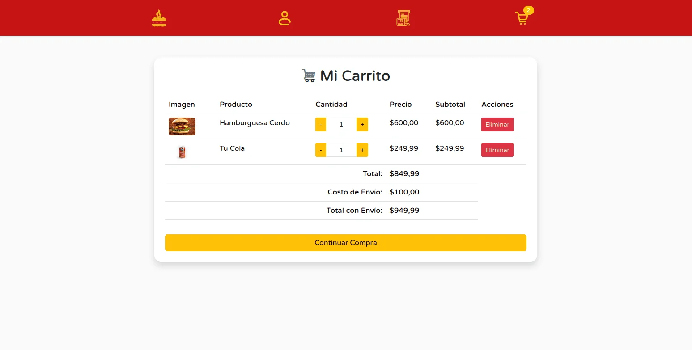
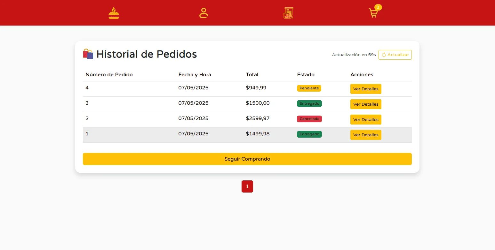
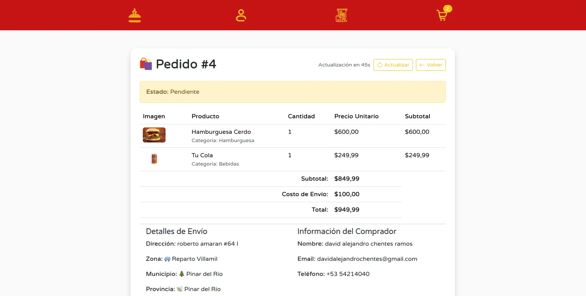

<div align="center">
  
  <h1 align="center">Tentador</h1>
  <p align="center">
    <strong>Tu antojo tiene nombre.</strong>
    <br />
    Un sistema de e-commerce completo para restaurantes, enfocado en la venta y entrega de hamburguesas a domicilio.
  </p>
  <p align="center">
    <a href="https://dj-tentador-production.up.railway.app/"><strong>Ver Demo en Vivo »</strong></a>
  </p>
</div>

---

## 🍔 Sobre el Proyecto

**Tentador** es una aplicación web robusta y completa desarrollada con Django, diseñada para gestionar un restaurante de comida a domicilio. La plataforma permite a los clientes explorar el menú, personalizar sus pedidos y recibirlos en la puerta de su casa, mientras que los administradores tienen un control total sobre los productos, pedidos y clientes.

El proyecto nació como una solución moderna y eficiente para digitalizar la experiencia de pedir comida, con un fuerte enfoque en la usabilidad, la rapidez y la automatización de procesos.

### ✨ Características Principales

#### Para Clientes:
- **Autenticación de Usuarios:** Sistema completo de registro e inicio de sesión.
- **Catálogo de Productos:** Visualización de productos por categorías, con imágenes, descripciones y precios.
- **Carrito de Compras:** Funcionalidad para agregar, actualizar y eliminar productos del carrito.
- **Proceso de Pedido:** Creación de pedidos con cálculo automático de costos de envío según la zona del cliente.
- **Historial de Pedidos:** Los usuarios pueden ver el historial de sus pedidos y el estado actual de cada uno (pendiente, en preparación, en camino, entregado).
- **Cancelación de Pedidos:** Opción para cancelar pedidos antes de que sean enviados.
- **Perfil de Usuario:** Los usuarios pueden actualizar su información personal y cambiar su contraseña.
- **Reseñas de Productos:** Posibilidad de dejar comentarios y valoraciones en los productos.

#### Para Administradores:
- **Panel de Administración Personalizado:** Interfaz de `django-jazzmin` para una gestión más amigable.
- **Gestión de Pedidos:** Visualización y administración de todos los pedidos recibidos.
- **Cambio de Estado de Pedidos:** Los administradores pueden actualizar el estado de un pedido, notificando al cliente.
- **Notificaciones por Telegram:** Envío automático de notificaciones a un chat de Telegram cuando se crea o cancela un pedido, para una gestión en tiempo real.
- **Gestión de Productos y Categorías:** Control total sobre el menú del restaurante.

---

### 🛠️ Tecnologías Utilizadas

*   **Backend:**
    *   
    *   
*   **Frontend:**
    *   
    *   
    *   
    *   
*   **Base de Datos:**
    *    (Producción)
    *    (Producción)
    *    (Desarrollo)
*   **Despliegue:**
    *   
    *   
    *   
*   **Notificaciones:**
    *   

---

## 🚀 Cómo Empezar

Sigue estos pasos para configurar y ejecutar el proyecto en tu entorno local.

### Prerrequisitos

Asegúrate de tener instalado Python 3.10 o superior.

### Instalación

1.  **Clona el repositorio:**
    ```bash
    git clone https://github.com/tu-usuario/DJ-Tentador.git
    cd DJ-Tentador
    ```

2.  **Crea y activa un entorno virtual:**
    ```bash
    python -m venv venv
    source venv/bin/activate  # En Windows: venv\Scripts\activate
    ```

3.  **Instala las dependencias:**
    ```bash
    pip install -r requirements.txt
    ```

4.  **Configura las variables de entorno:**
    Crea un archivo `.env` en la raíz del proyecto y añade las siguientes variables. Para desarrollo, solo necesitas la `SECRET_KEY`.
    ```env
    SECRET_KEY='tu_secret_key_aqui'
    # Variables para la base de datos de producción (PostgreSQL)
    DB_NAME='nombre_db'
    DB_USER='usuario_db'
    DB_PASSWORD='password_db'
    DB_HOST='host_db'
    DB_PORT='5432'
    # Variables para el bot de Telegram
    TG_BOT_TOKEN='tu_token_de_telegram'
    TG_CHAT_ID='tu_chat_id_de_telegram'
    ```

5.  **Aplica las migraciones:**
    ```bash
    python manage.py migrate
    ```

6.  **Crea un superusuario:**
    ```bash
    python manage.py createsuperuser
    ```

7.  **Ejecuta el servidor de desarrollo:**
    ```bash
    python manage.py runserver
    ```

¡Ahora puedes acceder a la aplicación en `http://127.0.0.1:8000`!

---

## 🖼️ Galería

<p align="center">
  
  
</p>
<p align="center">
  
  
</p>
<p align="center">
  
  
</p>
<p align="center">
  
  
</p>
---


